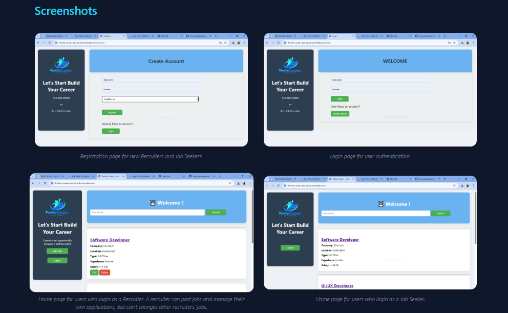

<h1 align="center">🚀 Fresho Career Job Board</h1>

<p align="center">
A Full-Stack Job Board Web Application built using Flask & PostgreSQL  
Deployed on Render with Production-Ready Architecture
</p>

<p align="center">
  <a href="https://fresho-career.onrender.com/"><strong>🌐 Live Demo</strong></a>
  
  
  
</p>

---

## 📌 Project Overview

Fresho Career is a role-based job board platform where:

- 👨‍💼 Recruiters can post, edit, and manage job listings
- 👩‍💻 Candidates can browse and search job opportunities
- 🔐 Secure authentication system with role-based access control
- 🗄 Persistent PostgreSQL cloud database
- 📡 SEO optimized with dynamic sitemap support

---

## ✨ Features

✅ User Registration & Login  
✅ Password Hashing (Secure Authentication)  
✅ Recruiter Role Authorization  
✅ Add / Edit / Delete Job Posts  
✅ Job Search & Filtering  
✅ Job Detail Pages  
✅ Google Sitemap Integration  
✅ Cloud Database (PostgreSQL)  
✅ Production Deployment on Render  

---

## 🏗 Tech Stack

| Technology | Usage |
|------------|--------|
| Python     | Backend Logic |
| Flask      | Web Framework |
| PostgreSQL | Cloud Database |
| psycopg2   | Database Adapter |
| HTML5/CSS3 | Frontend |
| Gunicorn   | Production Server |
| Render     | Deployment |

---

## 🗂 Project Structure
fresho-career-job-board/
│
├── app.py
├── requirements.txt
├── README.md
│
├── templates/
│ ├── index.html
│ ├── login.html
│ ├── register.html
│ ├── add_job.html
│ ├── edit_job.html
│ └── job_details.html
│
└── static/
├── style.css
└── FClogo.png

---


---

## ⚙️ Local Installation

```bash
git clone https://github.com/Ajay-paka/fresho-career-job-board.git
cd fresho-career-job-board
pip install -r requirements.txt
python app.py

